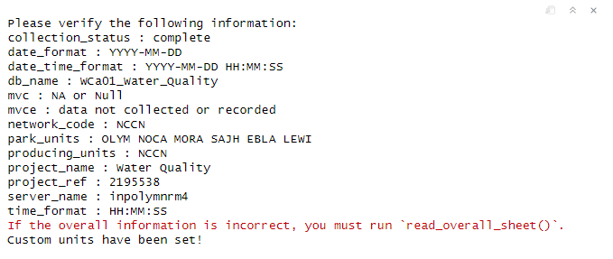
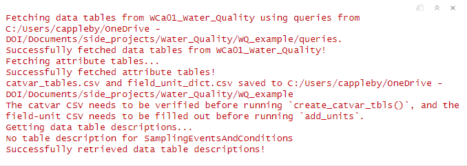
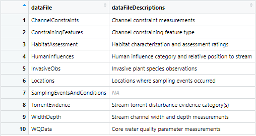
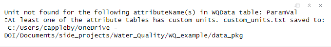
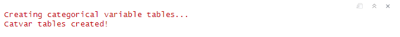
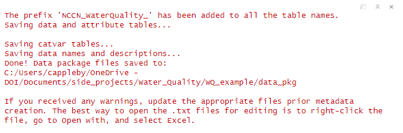

# fetchsqlserver

## Summary

This template walks through creating a data package and associated metadata
required for DataStore publication using the R package `fetchsqlserver` for
NCCN's Water Quality data. The narratives before code chunks are meant to inform
you of what package functions and data wrangling tools are covered in the code
chunks. Screenshots of relevants outputs are provided below the code chunks. The
template should be used as a supplement to the documentation.

The general workflow of creating a data package is as follows:

1.  Fetch data tables, attribute tables, and table descriptions using
    `fetch_sql_server_data()`. For the attribute tables, the SQL Server data
    types are converted to EML classes, and dateTimeStringFormats are added
    where applicable.

2.  Flatten or wrangle the data, if necessary.

3.  Attribute tables - add units for 'numeric' EML classes and save
    custom_units.txt, if applicable, and add missing value information.

4.  Create categorical variable tables for data table attributes will lookup/ref
    tables (where applicable).

5.  Save the data package (data table CSVs, attribute tables, and catvar
    tables).

6.  Create EML metadata, add NPS-specifics to the metadata, and save metadata as
    an XML.

7.  Check and upload the data package

### Setup .Rmd

When running chunks of code in an R Markdown document, messages, warnings, and
errors are displayed in the console, including user input requested via the
console from various functions. To ensure all of these are captured in the R
Markdown document when when it is rendered to a PDF, the chunk below needs to be
ran.

```{r setup, include=FALSE}
knitr::opts_chunk$set(
  echo = TRUE,
  message = TRUE,
  warning = TRUE,
  error = TRUE)
```

## Install and Load R Packages

The chunk below to installs the necessary packages. Even if the packages are
already installed, it is recommended to install them again to make sure you have
the most up-to-date versions.

```{r install_packages}
install.packages(c('devtools', 'tidyverse'))
devtools::install_github("nationalparkservice/NPSdataverse")
devtools::install_github("NPS-NCCN/fetchsqlserver_package")
```

Main packages needed, as well as additional packages that are used in this file
for data wrangling and flattening are in the chunk below.

```{r load_packages}
library(NPSdataverse)
library(fetchsqlserver)

library(dplyr)
library(stringr)
library(magrittr)
```

## Fetching SQL Server Data

### Set Working Directory

Many of the `fetchsqlserver` functions look for necessary files in a specific
directory where your queries are saved and where templates will be saved. More
detailed information is in the documentation. You can set this directory by
running `set_pkg_wd()`, which allows you to select a folder using File Explorer.
The folder path is saved as a hidden global variable. If you clear all object
from your workspace, including hidden objects, you will need to run this
function again.

```{r set_pkg_dir}
set_pkg_wd()
```

### Save and Fill Out Templates

The chunk below saves the data package info Excel spreadsheet template and the
metadata templates. You must fill out the spreadsheet before running
`fetch_sql_server_data()` because the function pulls the server and database
name from the spreadsheet. You must fill out the core metadata files before
running `create_EML_metadata()` and `create_nps_metadata()`. When you run
`save_metadata_templates()`, the templates should be saved to the folder that
will hold your data package files (data table CSVs, attribute and catvar tables,
metadata files, etc.). This will also save the folder path as a hidden global
variable. If you clear all object from your workspace, including hidden objects,
some functions may prompt you to select the folder again.

```{r save_templates}
save_data_info_template()
save_metadata_templates()
```

Once the spreadsheet is filled out, `read_data_pkg_info()` must be run prior to
running `fetch_sql_server_data`. This reads both the "overall" and
"custom_units" sheets and saves the information for various functions to use.

```{r read_xlsx}
read_data_pkg_info()
```



### Fetch the Data

`fetch_sql_server_data()` retrieves data tables, data table names and
descriptions, and data table attributes. The data tables are fetched using the
queries (see documentation). Additionally, a data package info Excel spreadsheet
needs to be filled out by the user prior to running `fetch_sql_server_data()`.
The template, *data_pkg_info.xlsx*, can be saved by running
`save_data_info_template()`, or by downloading it from the
`fetchsqlserver_package` GitHub.

The large list returned by `fetch_sql_server_data()` contains three items:

1.  A list containing data tables in data frames.

2.  A list containing the data table attributes (attribute tables). Each table
    is formatted so that it can be used to create EML metadata with the
    exception of two columns - RefSchemaName and RefTableName. Only fields with
    a foreign key relationship with have these columns filled in. These are used
    to create categorical variable tables later on.

3.  A data frame containing the data table name and description with the column
    headers dataFile and dataFileDescriptions. This is used during EML metadata
    creation.

Additionally, two CSVs are saved when the attribute tables are fetched -
*catvar_list.csv* and *field_unit_dict.csv*. *catvar_list.csv* contains the
schema and table names for any data table attributes with foreign keys. The CSV
also contains a Code and Description column for the lookup/ref table column
names associated with the Code and Description. These values are filled out
automatically with the first column of the lookup/ref table as the Code, and the
second column as the Description. The user must verify these are accurate prior
to running `create_catvar_tbls()`.

*field_unit_dict.csv* contains a list of fields that have an EML class of
"numeric". The unit for each field must be filled out by the user prior to
running `add_units()`. The unit must be in the unit dictionary, which can be
found by running `EMLassemblyline::view_unit_dictionary()`, or in the third
sheet of *data_pkg_info.xlsx*. It is easier to search the `EMLassemblyline`
dictionary. If the unit is not in the unit dictionary, it must be in the
*cust_units* sheet of *data_pkg_info.xlsx*.

```{r fetch_data}
data_list <- fetch_sql_server_data()
```



The query names are used to fetch the table descriptions. The data table
SamplingEventsAndConditions (the name of one of the queries) does not exist
because it is two tables combined into one.



The chunk below adds the table description, but this can be done several
different ways. Alternatively, you can wait until the data names and
descriptions Excel spreadsheet (*data_names_descriptions.xlsx*) is saved when
you run `save_data_pkg()` and edit the spreadsheet. The table name for WQData
needs to be changed as well; however, this will be done right before saving the
data package. That way, the table name does not need to be updated in
*field_unit_dict.csv*.

```{r add_tbl_desc}
data_list[[3]]$dataFileDescriptions[7] <- 
  "Sampling event weather and other conditions"
```

## Flattening and Wrangling Data

Only one Water Quality data table needs flattening, WaterChemistryData (WQData).
`fetchsqlserver` has functions to help you work with the `data_list` for data
flattening and wrangling.

-   `get_tbl_as_df(table_name, table_type = "data", data_list)` pulls the
    desired data frame from the data list. The table_type can either be
    `"data"`, which is the default, or `"attr"`.

-   `rearrange_attr_tbl(data_df, attr_df)` rearranges the attribute table rows
    to match the data table column order. Any attribute table rows that do not
    match a data table column are not kept. This is useful when you add rows to
    the data table, and therefore attribute table, so you only have to organize
    the data table columns. However, `rearrange_attr_tbl()` is ran in
    `save_data_pkg()` before actually saving the files. As a result, it is not
    necessary to run this function during data flattening and wrangling.

-   `update_data_list(table_name, data_list, data_df = NULL, attr_df = NULL)`
    replaces a data frame(s) in the `data_list`. You can replace just the data
    table, just the attribute table, or both.

-   `remove_from_data_list(table_name, data_list)` removes the data table and
    attribute table from the `data_list` and removes from the table names and
    descriptions data frame.

```{r flatten_data}
# Get the data table and attribute table
wqdata_df <- get_tbl_as_df('WQData', 'data', data_list)
wqdata_attr <- get_tbl_as_df('WQData', 'attr', data_list)

# Widen the data so each parameter code has its own column
wqdata_df %<>% tidyr::pivot_wider(names_from = ParamCode,
                                  values_from = ParamVal)

# Rearrange columns in data table
wqdata_df %<>% dplyr::relocate(PassCalibration:ProcessingFlag, 
                               .after = last_col())

# Add rows to attribute table for the parameters
# Create a new data frame to hold the info
new_wq_attr <- data.frame(matrix(nrow = 5,
                                 ncol = length(colnames(wqdata_attr))))
# Add column names to the new data frame
colnames(new_wq_attr) <- colnames(wqdata_attr)
# Add the attribute names using the column names from the data table
# Using the column indexes isn't ideal, but it works
new_wq_attr$attributeName <- colnames(wqdata_df)[8:12]
# Add the attribute definitions
new_wq_attr$attributeDefinition <- c('Measured dissolved oxygen', 
                                     'Measured pH', 
                                     'Measured specific conductivity', 
                                     'Measured temperature', 
                                     'Measured turbidity')
# Add the class as SQL Server data types
new_wq_attr$class <- c(rep('numeric', 5))
# Add the new attribute info to the attribute table
wqdata_attr <- dplyr::bind_rows(wqdata_attr, new_wq_attr)
```

The five individual water quality parameters have a numeric EML class;
therefore, the five new water quality parameter fields must be added to
*field_unit_dict.csv*.

There are a few data tables that require wrangling. InvasiveObs requires a bit
of work since the EstNum was recorded in the Notes column, not the EstNum
column.

```{r wrangle_inv_obs}
invobs_df <- get_tbl_as_df('InvasiveObs', 'data', data_list)
invobs_attr <- get_tbl_as_df('InvasiveObs', 'attr', data_list)

# Replace any 'Missing Data' values in the ScientificName column with NA
invobs_df$ScientificName <- gsub('Missing Data', NA, invobs_df$ScientificName)

# Rename the current Notes column (will be deleted) so we can create a new Notes 
# column that will stay with the data table.
invobs_df %<>% dplyr::rename(Notes_ = Notes)
# Create a new Notes column
invobs_df$Notes <- NA

# Go through each row of the data table
for (i in 1:nrow(invobs_df)) {
  # Get the value of the Notes_ column
  note <- invobs_df$Notes_[i]
  
  # If the note is not NA...
  if (!is.na(note)) {
    # Split up the note to run the parts through conditionals
    split_note <- stringr::str_split(note, ' ')
    
    # Check if the note contains a numerical value
    if (grepl('[0-9]', note)) {
      # Change the number to an integer
      est_num <- as.integer(gsub(".*?([0-9]+).*", "\\1", note))
      
      # A number less than or equal to 2000 is an EstNum
      if (est_num <= 2000) {
        # Add to EstNum column
        invobs_df$EstNum[i] <- est_num
      }
      # If the note starts with the EstNum...
      if (split_note[[1]][1] == as.character(est_num)) {
        # The EstNum has units that needs to go in the Notes column
        invobs_df$Notes[i] <- paste(split_note[[1]][2], '(EstNum units)')
      }
    }
    # If the note starts with 'Both'...
    if (split_note[[1]][1] == 'Both') {
      # Add it to the Notes column
      invobs_df$Notes[i] <- note
    }
    # Check if 'might' is in the note...
    else if (grepl('might', note)) {
      # Add 'might be native' to the Notes column
      invobs_df$Notes[i] <- 'might be native'
    }
  }
}

# Remove Notes_ column
invobs_df %<>% dplyr::select(-c(Notes_))

# Remove rows where ScientificName is NA
invobs_df %<>% dplyr::filter(!is.na(ScientificName))
```

HumanInfluences and ConstrainingFeatures simply need a couple of columns mutated
for consistency.

```{r wrangle_data_tbls}
humInf_df <- get_tbl_as_df('HumanInfluences', 'data', data_list)
# Change all ratings to uppercase
humInf_df %<>% dplyr::mutate(Rating = toupper(Rating))

constF_df <- get_tbl_as_df('ConstrainingFeatures', 'data', data_list)
# Update the ConstrainingFeature column to sentence case
constF_df$ConstrainingFeature <- 
  stringr::str_to_sentence(constF_df$ConstrainingFeature)
```

Although the lat/long coordinates can be added when you run
`create_EML_metadata()`, it is done during data wrangling to add the new columns
to the attribute table. It should be noted that the *field_unit_dict.csv* file
was updated to include DecimalLongitude and DecimalLatitude.

The EML classes for the new columns are added to the attribute table data frame
instead of the SQL Server data type. If you feel more comfortable adding the
data type instead, any SQL Server data types are converted to EML classes when
`save_data_pkg()` is run.

```{r wrangle_locs}
locs_df <- get_tbl_as_df('Locations', 'data', data_list)
locs_attr <- get_tbl_as_df('Locations', 'attr', data_list)

locs_df <- QCkit::generate_ll_from_utm(locs_df, 
                                       'UTM_East', 
                                       'UTM_North', 
                                       'UTMZone', 
                                       'UTMDatum',
                                       latlong_datum = "WGS84")

# Rename the coordinate columns in the data table
locs_df %<>% dplyr::rename(DecimalLongitude = decimalLongitude, 
                           DecimalLatitude = decimalLatitude,
                           DecimalDegreesDatum = LatLong_CRS)

# Rearrange columns
locs_df %<>% dplyr::relocate(DecimalLongitude:DecimalLatitude, .after = UTMDatum)
locs_df %<>% dplyr::relocate(DecimalDegreesDatum, .after = DecimalLatitude)

# Make DecimalDegreesDatum easier to read
locs_df$DecimalDegreesDatum <- "WGS84"

# Add rows to attribute table for lat/long and park name
# Create a new data frame to hold the info
new_locs_attr <- data.frame(matrix(nrow = 3, 
                                   ncol = length(colnames(locs_attr))))
# Add column names to the new data frame
colnames(new_locs_attr) <- colnames(locs_attr)
# Add the attributeNames
new_locs_attr$attributeName <- c('DecimalLongitude', 
                                 'DecimalLatitude', 
                                 'DecimalDegreesDatum')

# Add the new attributeDefinitions
new_locs_attr$attributeDefinition <- c('WGS84 longitude in decimal degrees', 
                                       'WGS84 latitude in decimal degrees', 
                                       'Datum for latitude and longitude')

# Add the new EML classes
new_locs_attr$class <- c(rep('numeric', 2), 
                         'character')

# Add the new data frame to the existing one
locs_attr <- dplyr::add_row(locs_attr, new_locs_attr)

# Add the DecimalDegreeDatum lookup table
locs_attr$RefSchemaName[16] <- "lookup"
locs_attr$RefTableName[16] <- "Datum"
```

Update the tables in the `data_list`. It is best to save the return of
`update_data_list()` as a new `data_list` in case you need to go back to the
original data tables and attribute tables.

```{r update_data_list}
data_list1 <- update_data_list("WQData", data_list, wqdata_df, wqdata_attr)
data_list1 <- update_data_list("InvasiveObs", data_list1, invobs_df, invobs_attr)
data_list1 <- update_data_list("Locations", data_list1, locs_df, locs_attr)
data_list1 <- update_data_list("HumanInfluences", data_list1, humInf_df)
data_list1 <- update_data_list("ConstrainingFeatures", data_list1, constF_df)
```

## Attribute Tables

The attribute tables need to be properly formatted to be read by
`EMLassemblyline` to create the EML metadata. To do that, we need to:

-   Add units for 'numeric' EML classes using `add_units()`.

-   Add missing value information using `missing_values_all_tbls()` or
    `missing_values()`.

```{r add_units}
data_list2 <- add_units(data_list1)
```



The warning about a unit not being found for ParamVal in WQData is because
ParamVal was widened into the individual parameters. ParamVal was manually
deleted from *field_unit_dict.csv* when the individual parameters were added,
and the field was not removed the attribute table data frame. ParamVal will be
deleted when `save_data_pkg()` is ran.

All of the Water Quality data tables can use the generic *MissingValueCode* and
*MissingValueCodeExplanation* from *data_pkg_info.xlsx*. However, you can use
`missing_values()` to identify which fields in a data frame have missing values
by only passing in the data table data frame. To add the generic missing value
information to one attribute table using `missing_values()`, pass the data table
data frame and attribute table data frame. Alternatively, you can run
`missing_values_all_tbls()` to add the generic missing value information to the
rest of the attribute tables.

```{r missing_values}
data_list3 <- missing_values_all_tbls(data_list2)
```

## Categorical Variable Tables

Catvar tables describes the catvars of a data table with the 'code' (value you
see in a data table) and 'definition' (what the code means or represents), which
is more commonly referred to as the 'description'. These tables are necessary to
create EML metadata. The attribute tables in the `data_list` have two columns,
'RefSchemaName' and 'RefTableName', which are used to identify attributes with
catvars. Additionaly, values from *catvar_list.csv* is used to query the
database to populate the 'code' and 'definition' columns of the catvar tables.

The catvar tables are created using `create_catvar_tbls`. A list containing the
`data_list`, a vector containing the catvar table names, and a list of catvar
tables is returned. As a result, it is best to save the return of
`create_catvar_tbls` as a new variable and extract the items afterwards. The
`catvar_list` saved below is used as an input to `save_data_pkg()`.

Before creating catvar tables, the WQData table name is updated so the catvar
table names match the table names and descriptions in the `data_list`.

```{r create_catvars}
data_list3[[3]]$dataFile[10] <- "WaterChemistryData"

catvar_data_list <- create_catvar_tbls(data_list3)

# Get the data_list
data_list4 <- catvar_data_list[[1]]

# Get the catvar table names and data frames into one list
catvar_list <- catvar_data_list[2:3]
```



## Save the Data Package

The data package consists of the data tables saved as CSVs, the attribute and
catvar tables are saved as TSVs, and the table descriptions data frame saved as
an XLSX. `save_data_pkg` automatically adds the network code and project name
from the data package info Excel spreadsheet to the beginning of all the data
table names. Example: *NCCN_WaterQuality_ChannelConstraints.csv*.

```{r save_data_pkg}
save_data_pkg(data_list4, catvar_list)
```



## Create EML Metadata

### Base EML

The 'base' EML consists of:

-   The overall package details - metadata file name, package title, data
    collection status, data table files, names and descriptions, and temporal
    information

    -   Read from the data package info Excel spreadsheet with
        `read_data_pkg_info()` or `read_overall_sheet()` and collected with
        `gather_eml_info()`

-   Core metadata information - abstract, methods, additional info, personnel,
    and keywords

    -   `save_core_metadata()` saves the templates to your selected data package
        folder

    -   **These files must be filled out prior to running
        `create_eml_metadata()`**

-   The information in the attribute and catvar tables

    -   `save_data_pkg()` saves these files

-   Geographic and taxonomic coverage

    -   Created with `gather_eml_info()`

-   Custom units

    -   If applicable, `read_data_pkg_info()` or `read_cust_units_sheet()` saves
        this file

### Creating Base EML

The base EML metadata information is put together using `gather_eml_info`.
Different data will be pulled from files, and the user is asked for various
inputs. The function writes the necessary files to create the EML metadata
(*geographic_coverage.txt* and *taxonomic_coverage.txt*). The output is a hash
dictionary that stores all the base EML information.

```{r base_eml_info}
eml_info <- gather_eml_info()
```

The next step is to create the base EML metadata. `create_EML_metadata()`
ensures all necessary core metadata files are present, converts *keywords.xlsx*
and *personnel.xlsx* to TSVs (tab-separated value text files), reads the
information stored in the `eml_info` hash dictionary, and passes the information
to `EMLassemblyline::make_eml()`. This function returns an `eml_object`.

```{r create_eml}
my_metadata <- create_eml_metadata(eml_info)
```

There is no funding information available for the personnel, so there is nothing
to update in the EML prior to proceeding.

### Add NPS-specific Metadata

NPS-specific metadata includes park units, producing units, intellectual rights,
CUI, and creating a DataStore reference, which is put together using
`gather_nps_info()`. The `eml_info` object is passed into the function so the
NPS-specific metadata user selections can be saved as well. The updated
`eml_info` is passed into `create_nps_eml()` to create complete metadata.

```{r nps_eml_info}
eml_info <- gather_nps_info(eml_info)
```

```{r add_nps}
# Copy the metadata object so you don't have to run the base EML stuff
# again if adding the NPS-specific metadata messes up the EML.
my_metadata2 <- create_nps_eml(eml_info, my_metadata)
```

### Save EML to an XML File

As long as the EML is valid, the EML needs to be saved as an XML file using
`write_eml_xml()` (which will check the validity of the EML as well). The data
package folder should contain the data tables, attribute tables, catvar tables,
and metadata files. During the data package creation process you were likely
prompted to select the data package folder; that is where `write_eml_xml()` will
look for the files and save the XML file to. Many messages will be produced when
the EML is checked. This is how you check if your schema is valid:

```         
── Reading metadata ──

── Checking metadata compliance ──

✔ Your metadata is schema valid.
```

There is also the option to update the `eml_info` object with the DataStore
Reference ID. If there was not an existing DataStore reference for this data
package, then the Reference ID was not saved in the `eml_info` object. To save
it, pass in the `eml_info` object and save it as a variable (shown below).
Otherwise, simply run `write_eml_xml()` without passing in the `eml_info`
object. Example XML file name:
*NCCN_WaterQuality_DataPackage_2010-2021_metadata.xml*.

```{r write_eml_xml}
eml_info <- write_eml_xml(my_metadata2, eml_info)
```

There are three warnings, but none of them need to be addressed.

### Upload Data Package to the DataStore

Before uploading the data package to the DataStore, congruence checks need to be
ran. The folder path to the data package needs to be provided.

```{r congruence_checks}
# Get the data package folder path
data_pkg_folder <- svDialogs::dlg_dir()$res
# Run congruence checks
DPchecker::run_congruence_checks(data_pkg_folder)
```

Again, the three warnings do not need to be addressed. If everything checked
out, you should be ready to upload your data package! It's recommended to use
`EMLeditor::upload_data_package` to accomplish this. The function automatically
checks the DOI and uploads to the correct reference on DataStore. All of the
files for the data package need to be in the same folder, there can be only one
.xml file (ending in "\_metadata.xml"). Each individual file should be \< 32Mb.
If you have files \> 32Mb, you will need to upload them manually using the web
interface on DataStore.

If the data package has been previously uploaded to the DataStore, the following
code can be used:

```{r remove_DS_files}
EMLeditor::remove_datastore_files(2303676)
```

The following code uploads the data package to the DataStore:

```{r upload_data_pkg}
EMLeditor::upload_data_package(data_pkg_folder)
```
